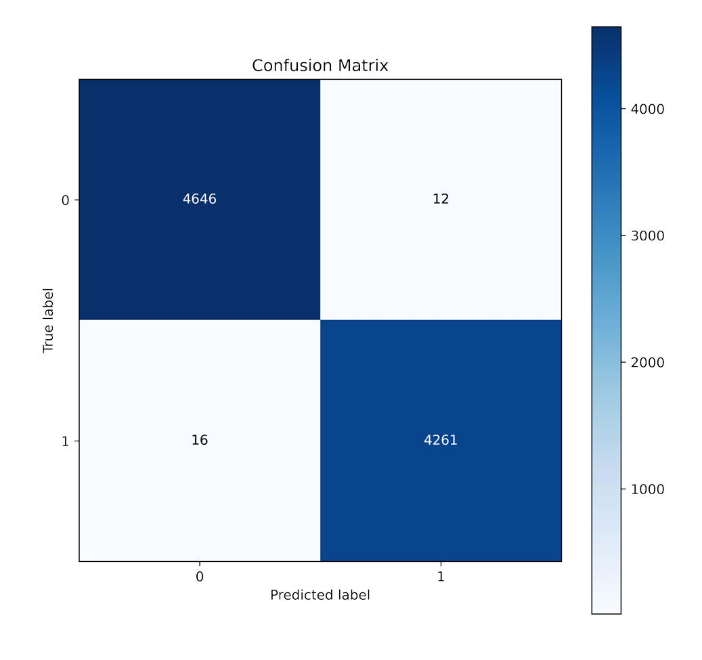

# News Authenticity Checker

## Project Overview

This project leverages Support Vector Machines (SVM) to identify and classify fake news effectively. It consists of two Jupyter notebooks:

- **`Machine Learning - Compared Models.ipynb`**: Compares multiple machine learning models to identify the most effective one for fake news detection.
- **`Machine Learning - SVM Model.ipynb`**: Focuses on training, optimizing, and evaluating the SVM model for fake news classification.

## Background

In today's digital era, the rapid spread of misinformation poses a significant threat to trust in communication. Fake news detection plays a vital role in maintaining information integrity and promoting media literacy. This project aims to tackle this issue by implementing machine learning, specifically SVM, to classify news articles as "true" or "fake" with high accuracy.

## Dataset

The dataset includes news articles from various sources, labeled as either "true" or "fake". It is provided in a compressed file format:

- **Dataset file**: [`Dataset.rar`](data/Dataset.rar)

To use the dataset:
- Download and extract the dataset.
- Place the extracted contents into the `data/` directory.

### Additional Files

- **`stop_words.txt`**: A text file containing a list of stop words (common words such as "the", "is", "in") that are typically removed during the text preprocessing step to improve model performance.


## Installation

To set up this project locally, follow these steps:

1. **Clone the repository:**
   ```bash
   git clone https://github.com/your-repo-url.git
   cd your-repo-name

2. **Install the required dependencies:**
   ```bash
   pip install -r requirements.txt

3. **Download and extract the dataset:**
- Download the dataset file Dataset.rar.
- Extract the contents and place them in a folder named data/.

4. **Run the notebooks:**
- Open Machine Learning - Compared Models.ipynb or Machine Learning - SVM Model.ipynb in Jupyter Notebook.
- Execute the cells step-by-step to reproduce the results.

## Features
- **Model Comparison:** Evaluate and compare multiple machine learning models to determine the best-performing model for fake news classification.
- **SVM Implementation:** Train and optimize an SVM model for accurate classification of fake news.
- **Performance Metrics:** Visualize key metrics such as accuracy, precision, recall, and confusion matrix.

### Example Results
Here’s an example of the SVM model’s confusion matrix:


## Contributing
We welcome contributions to improve this project! To contribute:

1. **Fork the repository.**
2. **Create a new branch for your feature:**
   ```bash
   git checkout -b feature-name
3. **Commit your changes and push the branch to your forked repository.**
4. **Open a pull request, and describe the changes you've made.**
